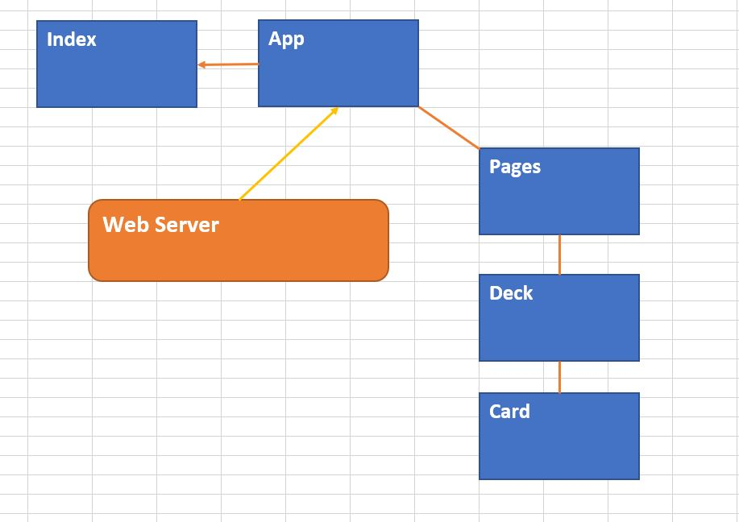

 LAB
=================================================

## Project Name
Full Stack Project

### Author: 
Trevor Stam

### Links and Resources
* [backend-repo](https://github.com/trevorstam/full-stack-project-backend)
* [deployed site backend](https://fullstack-backend-trevor.herokuapp.com/)
* [frontend-repo](https://github.com/trevorstam/full-stack-project-frontend)
* Can't deploy to AWS

### Modules
#### `index.js`
Imports component app and renders it

#### `App.js`
- Imports Page component and renders it.
- Mounts component, hooks up the heroku back end and sets state of content
- Exports App component

#### `Page.js`
- Imports Deck component and renders its content
- Exports Page component

#### `Deck.js`
- Imports Card component and renders its content
- Exports Deck component

#### `Card.js`
- Exports Card component

#### Tests
* No tests yet
* Run with npm test or yarn test

#### UML

